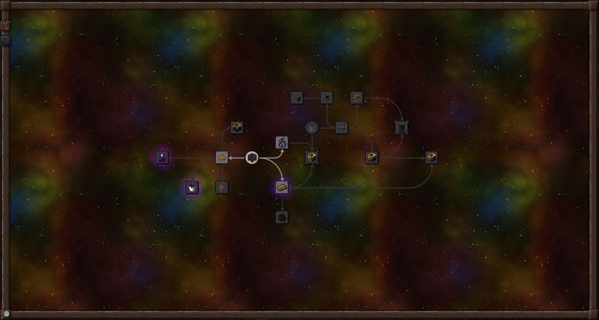
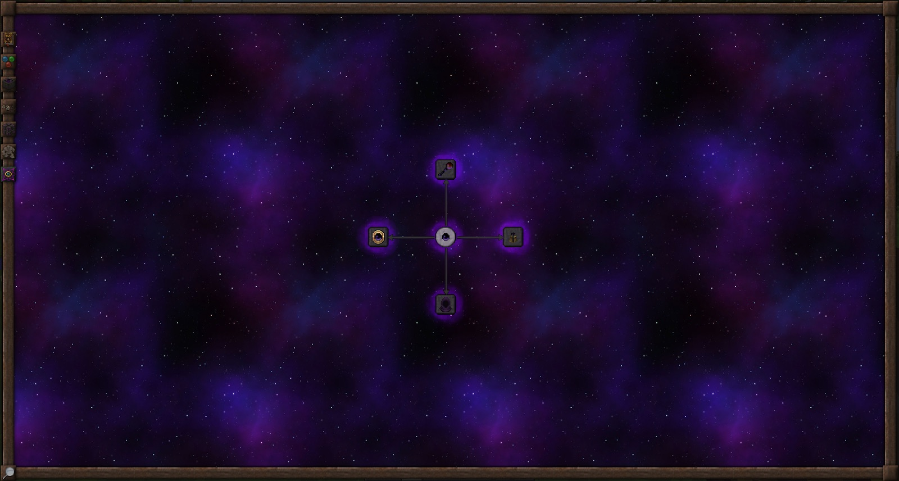

# Таумономикон: эталон именно Thaumcraft 6

Зафиксировано 30 сентября 2026. Эталон — **Thaumcraft 6.1.BETA26, Minecraft 1.12.2**.
Это описание оригинального интерфейса и требований к переносу, а не отчёт о готовности нового GUI.

Обновление 0.3.0-dev: граф и бумажный читатель уже реализованы; состояние и
отличия от спецификации описаны в `THAUMONOMICON.md` в корне проекта.

## Качественные изображения

Автор скриншотов руководства — Mephie/Tyith и участники MinecraftGuides.net.
Исходная версия руководства явно обозначена на его [главной странице](https://minecraftguides.net/tc6).
Для проверки использованы оригинальные файлы из закреплённого коммита
`cd14373456bfa3090663eb9dbf804f369313a7d7` репозитория руководства.

| Референс | Размер файла изображения | Что сверять |
| --- | --- | --- |
| [Дерево алхимии](references/tc6-alchemy-tree.jpg) | 1600×856 | Рамку, масштаб, левые вкладки, связи, разные формы узлов и состояния |
| [Дерево инфузии](references/tc6-infusion-tree.jpg) | 1600×856 | Собственный фон категории и расположение исследований |
| [Дерево Eldritch](references/tc6-eldritch-tree.jpg) | 1600×856 | Фиолетовый фон этой категории и подсветку |
| [Первые шаги, крупный фрагмент](references/tc6-first-steps.jpg) | 745×659 | Tooltip, направленные связи, недоступные узлы, значок книги |

Полные URL, SHA-256 и размеры приведены в [реестре ресурсов](reference-manifest.json).
Копии изображений не увеличивались, не перерисовывались и не улучшались генеративной моделью.
Это скриншоты TC6 из руководства; они не являются скриншотами нашего порта.
Присланный пользователем кадр задаёт желаемый характер интерфейса, но сам по себе не подтверждает номер версии.

## Оригинальные ресурсы вместо подбора похожего оформления

В репозитории TC6 есть все семь фоновых изображений **1024×1024**, наложение звёзд
**512×512**, атлас рамки/узлов/линий **256×256**, разворот книги и его overlay
**512×512**, а также иконки исследований. Их побайтовое совпадение с официальным
JAR проверено. Малый размер атласа — исходная пиксельная графика, а не потеря качества.

Расположение: `assets/thaumcraft/textures/gui/` в оригинале.

| Категория | Фон | Условие появления вкладки |
| --- | --- | --- |
| BASICS | `gui_research_back_1.jpg` | Нет дополнительного ключа категории |
| AUROMANCY | `gui_research_back_2.jpg` | `UNLOCKAUROMANCY` |
| ALCHEMY | `gui_research_back_3.jpg` | `UNLOCKALCHEMY` |
| ARTIFICE | `gui_research_back_4.jpg` | `UNLOCKARTIFICE` |
| INFUSION | `gui_research_back_7.jpg` | `UNLOCKINFUSION` |
| GOLEMANCY | `gui_research_back_5.jpg` | `UNLOCKGOLEMANCY` |
| ELDRITCH | `gui_research_back_6.jpg` | `UNLOCKELDRITCH` |

У TC6 фон меняется по категории. Единый ярко-фиолетовый фон для всех разделов
не воспроизводит оригинальный набор. Иконки и порядок категорий определяет
[ConfigResearch.java:138](https://github.com/TheDarkTower314/Thaumcraft-6-Source-Code/blob/954022bb777b7546281fb36df8522f0ba6b43f81/src/main/java/thaumcraft/common/config/ConfigResearch.java#L138).

## Дерево и управление

- Дерево занимает основную площадь экрана внутри рамки. Слева находятся категории базового TC6; категории аддонов оригинал размещает справа. Вкладки скрыты до соответствующего открытия.
- Координаты узлов берутся из `location` оригинальных JSON. Шаг исходной сетки — 24 GUI-пикселя; сама иконка — 16, рамка узла — 32. Узлы нельзя автоматически разложить равномерным списком без потери оригинальной структуры.
- ЛКМ позволяет перемещать карту; колесо меняет её масштаб. В оригинале `screenZoom` ограничен 1…2 с шагом 0.25, а отрисовка использует обратный масштаб. Положение карты сохраняется при переходе на страницу и обратно.
- `parents` образуют направленные связи, `siblings` — другой вид связей. Связи рисуются между исследованиями текущей категории. Префиксы ключей и стадийные зависимости нужно разбирать до поиска узла, не превращая их в отдельные исследования.
- `ROUND`, `HEX`, `SPIKY`, `HIDDEN`, `REVERSE` влияют на форму, доступность/отображение и направление оформления связи. Круг, квадрат, шестиугольник и лучистая рамка имеют различное назначение.
- Завершённые, доступные для начала, ещё недоступные и скрытые исследования — разные состояния. Видимый узел не обязательно доступен для открытия. Скрытый узел не должен раскрывать себя названием в обычном поиске.
- Есть подсветка запретного знания, значки нового исследования и новых страниц. Tooltip показывает название, текущую стадию, недостающие предпосылки и уведомления.
- Лупа открывает поиск по доступным категориям, известным исследованиям и результатам доступных рецептов. Это не постоянно открытая боковая таблица.

Проверено по [GuiResearchBrowser.java:177](https://github.com/TheDarkTower314/Thaumcraft-6-Source-Code/blob/954022bb777b7546281fb36df8522f0ba6b43f81/src/main/java/thaumcraft/client/gui/GuiResearchBrowser.java#L177),
[управлению:393](https://github.com/TheDarkTower314/Thaumcraft-6-Source-Code/blob/954022bb777b7546281fb36df8522f0ba6b43f81/src/main/java/thaumcraft/client/gui/GuiResearchBrowser.java#L393),
[отрисовке:518](https://github.com/TheDarkTower314/Thaumcraft-6-Source-Code/blob/954022bb777b7546281fb36df8522f0ba6b43f81/src/main/java/thaumcraft/client/gui/GuiResearchBrowser.java#L518)
и [навигации:807](https://github.com/TheDarkTower314/Thaumcraft-6-Source-Code/blob/954022bb777b7546281fb36df8522f0ba6b43f81/src/main/java/thaumcraft/client/gui/GuiResearchBrowser.java#L807).

## Страницы книги

Исследование открывается отдельным разворотом с бумажной текстурой, несколькими
страницами, рисунками, рецептами, требованиями стадии и кнопкой продолжения.
Оригинальный обработчик сохраняет ` `, `<LINE>`, `
`, `<PAGE>`, ``
как элементы разметки; их удаление, как в текущем прототипе, теряет содержание.
Есть вкладки аспектов и знаний, ссылки на рецепты с возвратом, схемы multiblock,
и addenda, появляющиеся по дополнительным открытиям.

Две текстовые страницы размечены по 140×210 GUI-пикселей. Это параметры
оригинальной раскладки, а не требование жёстко фиксировать размер окна 1.20.1.
В переносе требуется проверить масштаб GUI и перенос длинного русского текста.

Источники: [GuiResearchPage.java:141](https://github.com/TheDarkTower314/Thaumcraft-6-Source-Code/blob/954022bb777b7546281fb36df8522f0ba6b43f81/src/main/java/thaumcraft/client/gui/GuiResearchPage.java#L141),
[разворот:259](https://github.com/TheDarkTower314/Thaumcraft-6-Source-Code/blob/954022bb777b7546281fb36df8522f0ba6b43f81/src/main/java/thaumcraft/client/gui/GuiResearchPage.java#L259),
[разбор текста:1730](https://github.com/TheDarkTower314/Thaumcraft-6-Source-Code/blob/954022bb777b7546281fb36df8522f0ba6b43f81/src/main/java/thaumcraft/client/gui/GuiResearchPage.java#L1730).

## Что требуется заменить в порте 0.2.0-dev

`ResearchEntry` в версии 0.2 сохранял ключ, название, категорию, родителей и
упрощённые стадии. Для настоящего дерева требовалось вернуть координаты,
иконки, meta, siblings и addenda. Сырой оригинальный JSON уже сохранён в проекте.
Для работающих страниц понадобятся типизированные требования предметов,
крафтов, событий и расходуемых знаний, а не только счётчики уникальных сканов.

План переноса интерфейса:

1. Восстановить схему данных без изменения исходных координат и ключей.
2. Перенести рамку, фоны категорий, иконки и соединения из оригинальных ресурсов.
3. Добавить перемещение, масштаб, tooltip, категории и поиск с корректной видимостью.
4. Восстановить бумажные развороты, разметку, рецепты, стадии и addenda.
5. Соединить отображение с серверным состоянием исследований. Клик клиента не завершает исследование сам по себе.
6. Проверить русский/английский текст, возврат к дереву, все масштабы GUI и длинные страницы.

До реализации исходной прогрессии архив должен оставаться явно помеченным;
наличие красивого узла не должно обещать готовность его механики.
